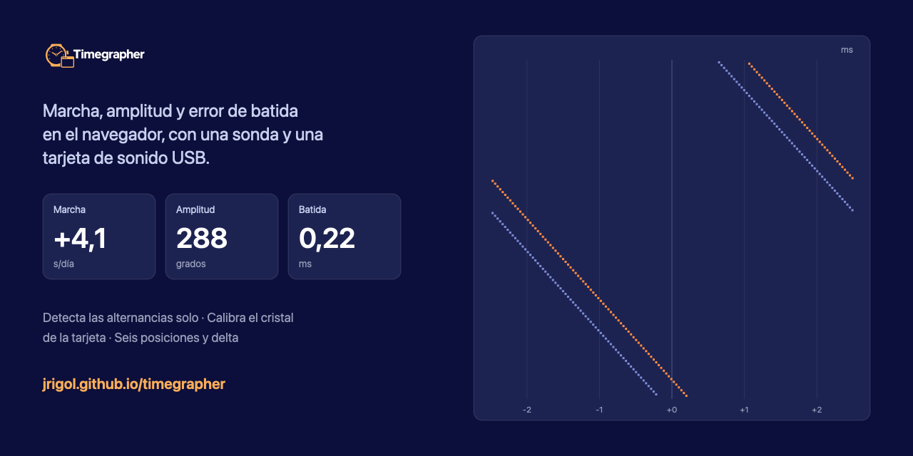

*[Español](README.md) · **English***

# Timegrapher web



A timegrapher for mechanical watches that runs entirely in the browser. It
measures **rate** (s/day), **amplitude** (degrees) and **beat error** (ms),
detects the **beats per hour** on its own, and draws the classic paper-tape
trace alongside the evolution of all three over time.

**→ [jrigol.github.io/timegrapher](https://jrigol.github.io/timegrapher/)**

No application server, no build step, no dependencies. Interface in Spanish and
English.

## The point

A bench timegrapher costs about as much as three or four practice movements.
This one needs a piezo/microphone probe and a **USB sound card** — the kind that
sells for a few euros. It is a standard USB Audio Class device, so the browser
reads the raw audio through `getUserMedia()` and every bit of signal processing
happens in JavaScript: no proprietary protocol to reverse-engineer, no driver to
install.

Hardware ceiling: **48 kHz, 16-bit, mono** (USB Audio Class 1.0 at full speed).
One sample is 20.8 µs, and tick timing is refined below the sample by
correlating each tick against a running template.

## Why you can trust the numbers

Most DIY timegraphers are toys for one reason: **they never calibrate the sound
card's crystal.** A cheap one drifts ±50–100 ppm, and

```
100 ppm × 86400 s = 8.64 s/day of pure measurement error
```

which is more than the entire tolerance band of a COSC chronometer (−4/+6 s/d).
Uncalibrated, a rate reading means nothing in absolute terms.

This one compares the `AudioWorklet` frame counter against the NTP-disciplined
system clock by regression over every delivered block. Two minutes of baseline
gives ±0.12 s/day; five minutes ±0.03 s/day. The correction is stored per device
in `localStorage` — each card has its own crystal, and two dongles of the same
model can sit 200 ppm apart.

It affects **the rate only**. Beat error is a difference (100 ppm over 1 ms is
0.0001 ms) and amplitude depends on `dt/T`, where the factor cancels out.

## How each figure is derived

**Beats per hour.** Autocorrelation of the envelope, deliberately independent of
the peak detector: a badly set threshold loses every other tick and produces a
silent octave error (28800 read as 14400). Candidates are scored by
`acf[L] + acf[2L]` — the second harmonic tells a real period from an intra-tick
artefact — and the smallest surviving lag is the beat. The result is snapped to
the nearest standard value within ±2%; the two closest table entries (18000 and
19800) are 10% apart, so there is no ambiguity.

**Rate and beat error.** Least squares on

```
t_i = a + b·i + c·(−1)^i
```

The alternating term absorbs the beat error and leaves the mean period `b` clean.
From there `rate = (T_nominal − b)/T_nominal × 86400` and
`beat error = 2|c|`, which is also the separation between the two traces on the
tape. Fitting the slope across the whole window beats averaging intervals: each
tick's timing error is spread over the entire baseline.

**Amplitude.** The three escapement noises inside each tick (unlocking, impulse,
drop) are resolved and the interval between the first and the third is measured:

```
A = lift_angle / (2 · sin(π · dt / T))
```

with `T` the full oscillation period (two beats). For 28800 bph, a 52° lift angle
and 280° of amplitude, `dt` is around 7.4 ms. The lift angle is a property of the
calibre and cannot be measured from the audio.

This is the delicate one: it depends on resolving two faint clicks that barely
clear the noise. If it will not settle, check the **signal quality** indicator
first — it is almost always the sensor coupling, not the algorithm.

## Measuring by position

The diagnosis lives in the differences between positions, not in any single
reading. The *Positions* section covers the standard six:

1. Place the watch and press the position — or its number, **1 to 6**, which is
   what works when your hands are full. `Esc` cancels.
2. The measurement restarts (data from the previous position belongs to another
   mounting) and waits for the reading to **settle**: a full window of new data,
   the rate steady within 2 s/day and the amplitude within 6°. If it detects the
   watch moving again, it restarts the count.
3. Once settled it captures rate, amplitude and beat error on its own.

With two or more positions the figures that matter appear:

- **Delta**: highest rate minus lowest. It is the criterion a watch is judged by;
  COSC allows up to 10 s/day for a chronometer. The two extreme cells are marked.
- **Amplitude drop** from horizontal to vertical. Above roughly 50° it is worth
  looking at pivots or poise.
- **Worst beat error** of the run.

*Copy* puts the table on the clipboard as text; *CSV* downloads it with the
separator and decimal mark the interface language expects.

## Running it locally

```sh
python3 -m http.server 8000
```

then open <http://localhost:8000>. It has to be over HTTP: ES modules and the
microphone do not work over `file://`, and `getUserMedia` requires a secure
origin (HTTPS or `localhost`).

## Verification

```sh
node test/synthetic.mjs   # the whole chain against a signal of known parameters
node test/units.mjs       # calibration arithmetic, i18n, palette, render paths
```

`synthetic.mjs` generates tick trains with known rate, beat error, amplitude and
bph — including the awkward cases: a tock 16× quieter than the tick, and a high
noise floor — and pushes them through the same chain the application uses, in
4096-sample blocks. It recovers the rate to better than 0.01 s/day, the beat
error to 0.002 ms and the amplitude to 0.03°.

## Known limitations

- Uncalibrated, the absolute rate carries the crystal's error (up to ±8.6 s/day).
- Amplitude depends on the lift angle, which has to be entered by hand. The
  presets are commonly published values; confirm them against the calibre's data
  sheet.
- Mechanical watches only. A quartz movement (one tick per second) falls outside
  the bph search range.

## Licence

MIT.
